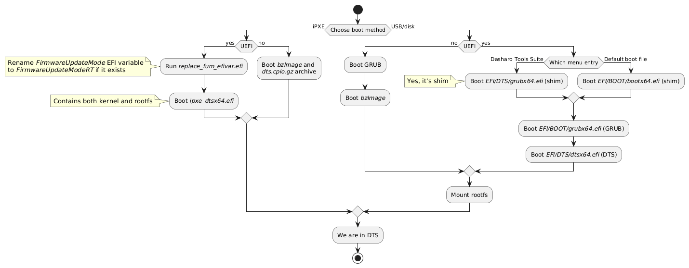

# DTS boot paths

This document describes how DTS can be booted and which files are used in those
different boot paths. Diagram below shows the most important elements



* iPXE - this assumes that [dts.ipxe](https://boot.dasharo.com/dts/dts.ipxe)
    script is used
    - on non-UEFI firmware old method is still used, i.e. booting `bzImage` and
    `.cpio.gz` archive
    - on UEFI firmware we first run a small EFI application that renames
        FirmwareUpdateMode variable if it exists (workaround for
        [Dasharo/dasharo-issues#1759](https://github.com/Dasharo/dasharo-issues/issues/1759)),
        and then we boot `ipxe_dtsx64.efi` ([Unified Kernel
    Image](https://uapi-group.org/specifications/specs/unified_kernel_image/))
    which contains both kernel and rootfs.
* USB/disk
    - on non-UEFI firmware we first boot GRUB which then boots kernel
        (`bzImage`). This GRUB, unlike when booting via UEFI is embedded inside
        boot partition itself. You can read more about [MBR boot flow
        here](https://neosmart.net/wiki/mbr-boot-process/)
    - on UEFI firmware we first boot shim, which then boots GRUB which then
        boots DTS. This is fairly standard flow used when booting Linux systems.

## Dasharo UEFI

When analyzing UEFI boot flow one can notice that shim is mentioned twice
* `EFI/BOOT/bootx64.efi`
* `EFI/DTS/grubx64.efi`

The first path is the default file booted by UEFI firmware. The second path is
detected automatically by Dasharo firmware and boot menu entry is created under
`Dasharo Tools Suite` name. This and the fact that shim should be the first
file booted if one wants to use GRUB with Secure Boot is the reason why
`EFI/DTS/grubx64.efi` is actually shim and not GRUB. The real GRUB is under
`EFI/BOOT/grubx64.efi` which is booted by shim.

## Secure Boot

### USB

UEFI boot flow was made specifically so it could be compatible with Secure Boot.
Currently, all files are built unsigned and there are no certificates embedded
inside of shim or GRUB, but it's possible to sign all files by yourself.

Minimal USB example that allows booting DTS with Secure Boot enabled.

1. Generate Secure Boot key/certificate that'll be used for signing `.efi` files

    ```sh
    openssl req -new -x509 -newkey rsa:2048 -nodes \
        -keyout sb.key -out sb.crt -subj "/C=PL"
    openssl x509 -in sb.crt -out sb.cer -outform DER
    ```

2. Decompress and mount DTS boot partition

    ```sh
    bmaptool copy images/dts-base-image-genericx86-64.wic.gz dts.img
    dev=$(sudo losetup --show -Pf dts.img)
    sudo mount "${dev}p1" /mnt
    ```

3. Sign all files

    ```sh
    sudo sbsign --key sb.key --cert sb.crt /mnt/EFI/BOOT/bootx64.efi --output /mnt/EFI/BOOT/bootx64.efi
    sudo sbsign --key sb.key --cert sb.crt /mnt/EFI/BOOT/grubx64.efi --output /mnt/EFI/BOOT/grubx64.efi
    sudo sbsign --key sb.key --cert sb.crt /mnt/EFI/DTS/grubx64.efi --output /mnt/EFI/DTS/grubx64.efi
    sudo sbsign --key sb.key --cert sb.crt /mnt/EFI/DTS/dtsx64.efi --output /mnt/EFI/DTS/dtsx64.efi
    ```

4. Copy certificate to boot partition. We will add it to Secure Boot allowed
    signatures (DB) later

    ```sh
    sudo cp sb.cer /mnt
    ```

5. Unmount everything.

    ```sh
    sudo umount /mnt
    sudo losetup -d "${dev}"
    ```

6. Now you can flash `dts.img` on USB flash drive or run it in e.g. QEMU.
7. Enable SB and enroll `sb.cer` into
    [DB](https://docs.dasharo.com/dasharo-menu-docs/device-manager/#enabling-secure-boot)
8. Boot DTS. If you've done everything correctly DTS should boot without any
    problems. You can verify Secure Boot state by checking dmesg output in
    shell:

    ```sh
    bash-5.2# dmesg | grep 'Secure boot'
    [    0.004989] Secure boot enabled
    ```

### iPXE

Example below allows booting DTS via iPXE with Secure Boot enabled.

1. Generate Secure Boot key/certificate (or use previous ones) as described in
    [Secure Boot USB](#usb)
2. Sign `ipxe_dtsx64.efi`. You can download it from <https://boot.dasharo.com>
    or build it yourself (it's in `build/tmp/deploy/images/genericx86-64/`)

    ```sh
    sbsign --key sb.key --cert sb.crt ipxe_dtsx64.efi --output ipxe_dtsx64.efi
    ```

3. Start HTTP server

    ```sh
    python -m http.server
    ```

4. Enable SB and enroll `sb.cer` into
    [DB](https://docs.dasharo.com/dasharo-menu-docs/device-manager/#secure-boot-configuration)
    on your test firmware e.g. in QEMU.
5. Boot `ipxe_dtsx64.efi` via iPXE. You can follow steps in
    [Launching DTS](https://docs.dasharo.com/dasharo-tools-suite/documentation/running/#launching-dts)
    section. The only difference is in `chain` command:

    ```text
    chain http://localhost:8000/ipxe_dtsx64.efi
    ```

    If you are using iPXE on another platform (not QEMU) you should replace
    `localhost` with IP of the host with HTTP server running.

To also run `replace_fum_efivar.efi` you have to

1. Sign `replace_fum_efivar.efi` the same way you have signed `ipxe_dtsx64.efi`

    ```sh
    sbsign --key sb.key --cert sb.crt replace_fum_efivar.efi --output replace_fum_efivar.efi
    ```

1. Modify iPXE commands:

    ```text
    chain http://localhost:8000/replace_fum_efivar.efi
    imgfree
    chain http://localhost:8000/ipxe_dtsx64.efi
    ```

## Live image

Instead of booting `ipxe_dtsx64.efi` via iPXE you can instead use it as live
USB image. In short, you just have to boot `ipxe_dtsx64.efi` directly, either by
using [Boot from
file](https://docs.dasharo.com/dasharo-menu-docs/boot-maintenance-mgr/#boot-from-file)
menu, or by creating dedicated flash drive. Below is one such example, that will
create `dts-live.img` that can be used in QEMU or flashed into USB flash drive:

```sh
dd if=/dev/zero of=dts-live.img bs=1 seek=400M count=0
printf '%s\n' "n" "p" "1" "" "" "t" "ef" "w" | fdisk dts-live.img
dev=$(sudo losetup --show -Pf dts-live.img)
sudo mkfs.vfat "${dev}p1" -n DTS-LIVE
sudo mount "${dev}p1" /mnt
sudo mkdir -p /mnt/EFI/BOOT
sudo cp ipxe_dtsx64.efi /mnt/EFI/BOOT/bootx64.efi
sudo umount /mnt
sudo losetup -d "${dev}"
sync
```

This booting method will only work on UEFI firmware.
